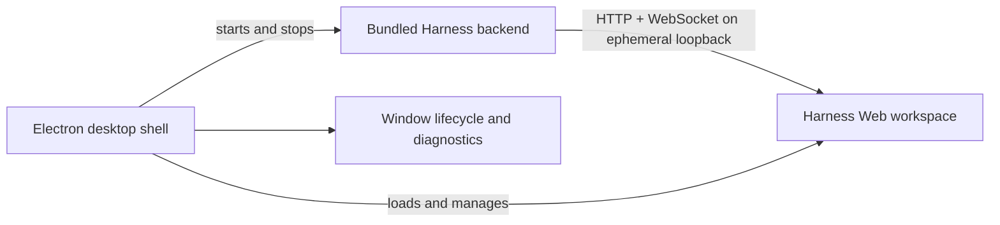

# DeepSeek Harness Desktop

English | [中文](README.zh.md)

<p align="center"><strong>An unofficial Windows desktop client for DeepSeek Harness.</strong></p>

<p align="center">
  
  
  <a href="LICENSE"></a>
</p>

DeepSeek Harness Desktop is an independently developed, third-party desktop edition built on the open-source [DeepSeek Harness](https://github.com/deepseek-ai/deepseek-harness) project. It packages the existing Harness Web workspace and backend into a managed Electron application with native window behavior, startup diagnostics, and a Windows installer.

> **Unofficial project:** This project is not affiliated with, maintained by, or endorsed by DeepSeek or the `deepseek-ai` organization. DeepSeek Harness remains an upstream dependency and retains its own project identity and support channels.

## Highlights

- **Desktop-first workflow.** Launch Harness from a native Windows application instead of starting a terminal process and managing a browser tab.
- **Managed backend lifecycle.** The application selects an ephemeral loopback port, starts the bundled Harness backend, waits for readiness, and terminates the process tree on exit.
- **Complete Harness workspace.** Sessions, tools, terminal access, settings, model selection, and plugin-provided UI come from the upstream Web workspace rather than a reduced desktop reimplementation.
- **Purpose-built startup experience.** A polished loading screen reports preparation, backend startup, connection, readiness, and recoverable failures inside the application.
- **Portable installer.** The packaged application includes its production backend and Electron runtime; end users do not need to install Node.js or pnpm separately.
- **Restricted desktop bridge.** The renderer has no Node.js integration, navigation is limited to loopback Harness URLs, and external links open in the system browser.

## Requirements

| Use case | Requirement |
|---|---|
| Run the installed application | Windows x64 |
| Develop or package from source | Windows, Node.js `^22.19.0 || >=24.0.0`, pnpm `11.7.0` |
| Use model-backed features | A model provider configured in Harness |

## Get started

### Run in development

From the repository root:

```sh
pnpm install
pnpm run dev:desktop
```

The command builds the Harness libraries and Web client, starts Electron, and launches a local Harness backend automatically. On first use, configure a model under **Settings → Models**, choose a workspace, and create a session.

### Build the Windows installer

```sh
pnpm run dist:desktop
```

The NSIS installer is written to `.artifacts/desktop-release/`. The unpacked application used for local verification is written beside it under `win-unpacked/`.

## How it works



The desktop main process owns the backend child process, startup probes, persisted window bounds, external-link handoff, and application shutdown. An isolated preload exposes only the desktop operations required by the title bar and startup experience. The Harness Web workspace continues to own conversations, tools, settings, terminal sessions, and plugin UI.

The current release uses the upstream loopback Web transport so it can load the complete plugin-composed workspace without maintaining a second delivery path. A native Electron IPC transport would require coordinated changes to API requests, event streams, plugin delivery, and privileged desktop operations.

## Security model

- Backend URLs must use HTTP on `localhost`, `127.0.0.1`, or `::1`; credentials in URLs are rejected.
- Renderer processes run with context isolation and sandboxing enabled and without Node.js integration.
- Navigation outside the local Harness application is denied in the window and handed to the system browser.
- Closing the desktop application terminates the managed Harness process tree.
- The installer does not embed model-provider credentials; Harness stores user configuration in per-user application data directories.

## Current limitations

- Packaging currently targets Windows x64; macOS and Linux installers are not provided.
- The application depends on upstream Harness Web and CLI internals, so an upstream architecture change may require a desktop compatibility update.
- The desktop transport uses a private loopback HTTP and WebSocket server rather than native Electron IPC.
- Release artifacts are not code-signed. Windows SmartScreen may display a warning for locally built installers.
- Desktop-specific bugs belong to this third-party project, not the upstream DeepSeek Harness support channels.

<a id="run"></a>

## Run the upstream Web workspace

This repository retains the upstream Web and CLI applications for compatibility and development. To run the Web workspace without the desktop shell:

```sh
npx @deepseek-ai/dsh web
```

The upstream [Web UI guide](docs/user/guide/index.md) documents model configuration, workspace selection, and sessions.

<a id="run-from-source"></a>

## Development

```sh
pnpm install
pnpm run build:desktop
pnpm --filter @deepseek-ai/dsh-desktop run test
pnpm run lint
```

The [desktop application reference](apps/desktop/README.md) documents environment variables, packaging, lifecycle, and the loopback trust rules. The upstream [architecture overview](docs/architecture.md) and [development guide](docs/development.md) apply to inherited Harness packages.

## Upstream and attribution

This project builds on [deepseek-ai/deepseek-harness](https://github.com/deepseek-ai/deepseek-harness) and preserves its plugin-composed Web workspace. Upstream source, documentation, and community channels remain under their respective maintainers; product names and trademarks belong to their respective owners. Changes under `apps/desktop/` and the desktop packaging integration are specific to this third-party edition.

When reporting a problem, first identify whether it reproduces in the upstream `dsh web` application. Report upstream behavior to the upstream project; report Electron startup, window, installer, or packaged-backend behavior to the distributor of this desktop edition.

## License

This repository follows the upstream project's [MIT License](LICENSE). Third-party dependencies and their licenses are listed in [THIRD_PARTY_NOTICES.md](THIRD_PARTY_NOTICES.md).
