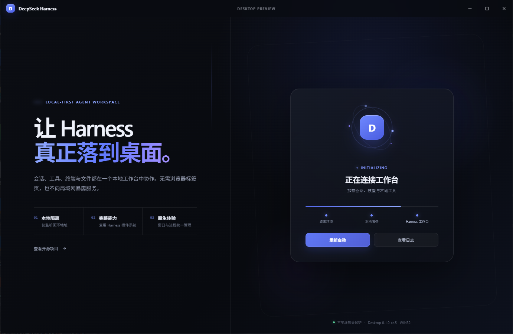
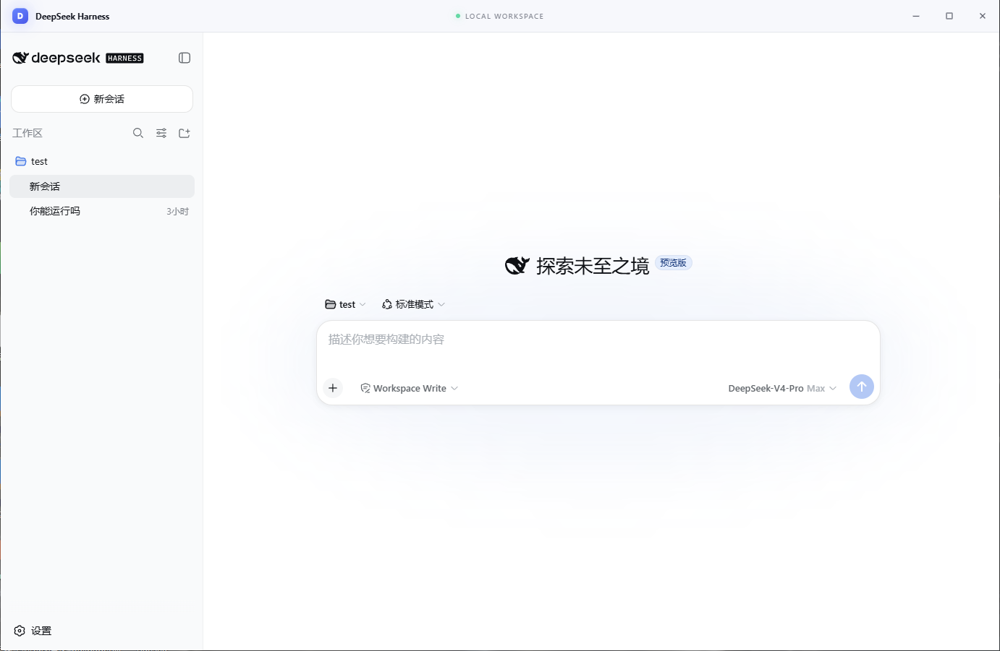
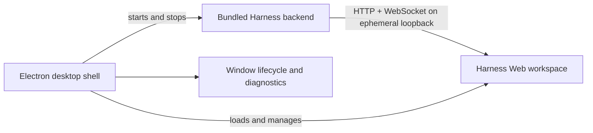

# DeepSeek Harness Desktop

[English](README.md) | 中文

<p align="center"><strong>基于 DeepSeek Harness 构建的非官方 Windows 桌面客户端。</strong></p>

<p align="center">
  
  
  <a href="LICENSE"></a>
</p>

DeepSeek Harness Desktop 是基于开源项目 [DeepSeek Harness](https://github.com/deepseek-ai/deepseek-harness) 独立开发的第三方桌面版本。它将现有 Harness Web 工作台与后端打包为受管理的 Electron 应用，并提供原生窗口行为、启动诊断和 Windows 安装程序。

> **非官方项目：** 本项目与 DeepSeek 或 `deepseek-ai` 组织不存在隶属关系，也不由其维护或背书。DeepSeek Harness 是本项目的上游依赖，保留其独立的项目身份与支持渠道。

## 界面预览

### 启动页



### 主页



## 核心特性

- **桌面优先的工作方式。** 直接从 Windows 原生应用启动 Harness，无需手动运行终端进程和管理浏览器标签页。
- **受管理的后端生命周期。** 应用会选择临时回环端口，启动随包提供的 Harness 后端，等待服务就绪，并在退出时终止整个进程树。
- **完整的 Harness 工作台。** 会话、工具、终端访问、设置、模型选择与插件提供的 UI 均来自上游 Web 工作台，而不是功能缩减的桌面重写版本。
- **专门设计的启动体验。** 精细化加载页面会在应用内展示准备、后端启动、连接、就绪和可恢复失败状态。
- **便携式安装程序。** 打包后的应用包含生产后端与 Electron 运行时；最终用户无需另行安装 Node.js 或 pnpm。
- **受限的桌面桥接。** 渲染器无法使用 Node.js，导航仅允许回环 Harness URL，外部链接由系统浏览器打开。

## 环境要求

| 使用场景 | 要求 |
|---|---|
| 运行已安装应用 | Windows x64 |
| 从源码开发或打包 | Windows、Node.js `^22.19.0 || >=24.0.0`、pnpm `11.7.0` |
| 使用模型相关功能 | 已在 Harness 中配置模型提供方 |

## 快速开始

### 开发模式运行

在仓库根目录执行：

```sh
pnpm install
pnpm run dev:desktop
```

该命令会构建 Harness 库与 Web 客户端、启动 Electron，并自动运行本地 Harness 后端。首次使用时，请在**设置 → 模型**中配置模型，选择工作区，然后创建会话。

### 构建 Windows 安装程序

```sh
pnpm run dist:desktop
```

NSIS 安装程序会写入 `.artifacts/desktop-release/`。用于本地验证的免安装应用位于同目录下的 `win-unpacked/`。

## 工作原理



桌面主进程负责后端子进程、启动探测、持久化窗口边界、外部链接交接和应用关闭。隔离的 preload 只暴露标题栏与启动体验所需的桌面操作。Harness Web 工作台继续负责对话、工具、设置、终端会话与插件 UI。

当前版本使用上游回环 Web 传输，因此无需维护第二套交付路径即可加载完整的插件组合工作台。原生 Electron IPC 传输需要协同修改 API 请求、事件流、插件交付与特权桌面操作。

## 安全模型

- 后端 URL 必须使用 `localhost`、`127.0.0.1` 或 `::1` 上的 HTTP，且 URL 中不得包含凭据。
- 渲染进程启用上下文隔离与沙箱，且无法使用 Node.js。
- 窗口会拒绝本地 Harness 应用之外的导航，并将外部链接交给系统浏览器。
- 关闭桌面应用会终止受管理的 Harness 进程树。
- 安装程序不会嵌入模型提供方凭据；Harness 将用户配置保存在当前用户的应用数据目录中。

## 当前限制

- 当前仅提供 Windows x64 打包；尚未提供 macOS 与 Linux 安装程序。
- 应用依赖上游 Harness Web 和 CLI 内部实现，因此上游架构变化可能需要桌面兼容更新。
- 桌面传输使用私有回环 HTTP 与 WebSocket 服务器，而不是原生 Electron IPC。
- 发布产物尚未进行代码签名。Windows SmartScreen 可能会对本地构建的安装程序显示警告。
- 桌面端特有问题应提交给本第三方项目，而不是上游 DeepSeek Harness 支持渠道。

<a id="run"></a>

## 运行上游 Web 工作台

本仓库保留上游 Web 与 CLI 应用，以支持兼容性和开发工作。如需跳过桌面外壳并运行 Web 工作台：

```sh
npx @deepseek-ai/dsh web
```

模型配置、工作区选择和会话操作见上游 [Web UI 指南](docs/user/guide/index.md)。

<a id="run-from-source"></a>

## 开发

```sh
pnpm install
pnpm run build:desktop
pnpm --filter @deepseek-ai/dsh-desktop run test
pnpm run lint
```

[桌面应用参考](apps/desktop/README.md)记录了环境变量、打包、生命周期与回环信任规则。继承的 Harness 包仍遵循上游[架构概览](docs/architecture.md)与[开发指南](docs/development.md)。

## 上游关系与致谢

本项目构建于 [deepseek-ai/deepseek-harness](https://github.com/deepseek-ai/deepseek-harness) 之上，并保留其插件组合 Web 工作台。上游源码、文档和社区渠道仍由相应维护者负责；产品名称与商标归各自权利人所有。`apps/desktop/` 下的改动与桌面打包集成属于本第三方版本。

提交问题前，请先确认问题是否能在上游 `dsh web` 应用中复现。上游行为应反馈给上游项目；Electron 启动、窗口、安装程序或打包后端问题应反馈给此桌面版本的分发方。

## 许可证

本仓库沿用上游项目的 [MIT License](LICENSE)。第三方依赖及其许可证见 [THIRD_PARTY_NOTICES.md](THIRD_PARTY_NOTICES.md)。
